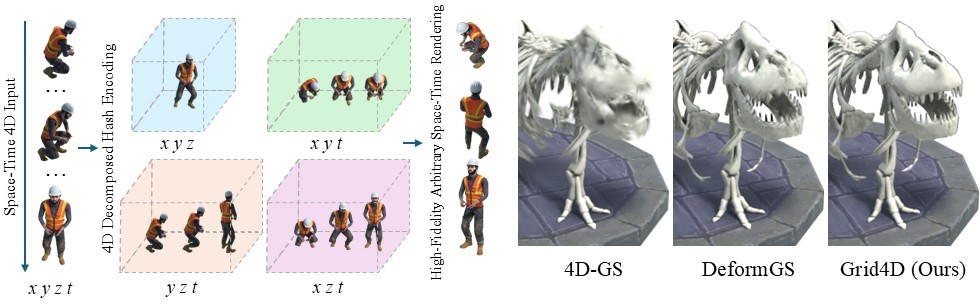
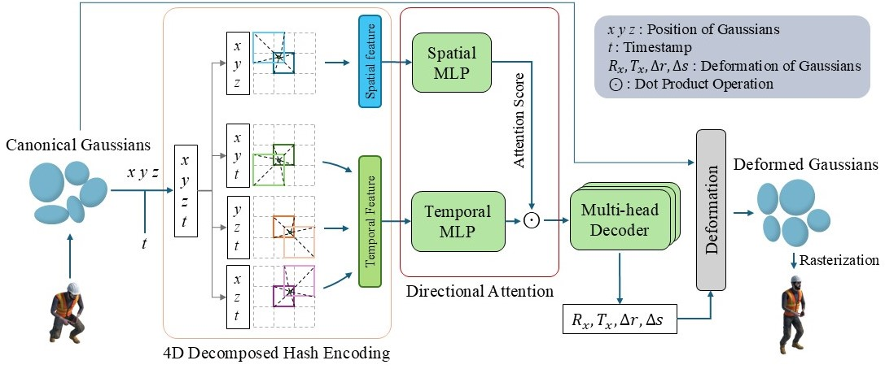
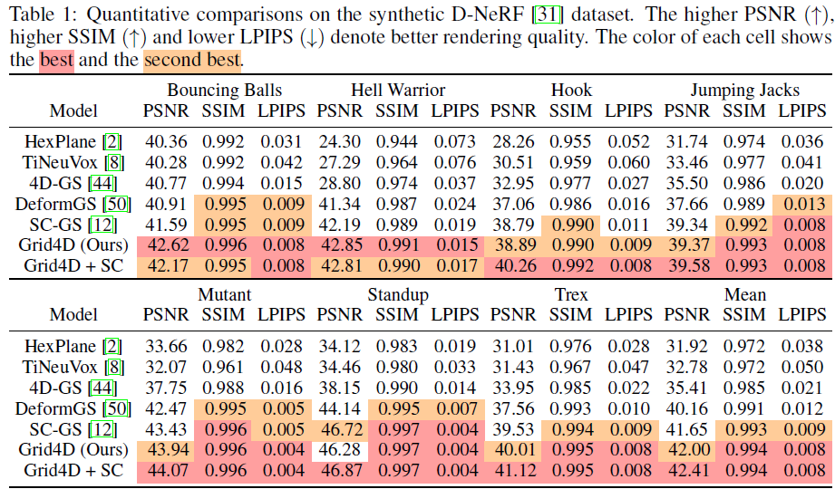

# Grid4D: 4D Decomposed Hash Encoding for High-fidelity Dynamic Gaussian Splatting
[NeurIPS 2024] Official implementation of "Grid4D: 4D Decomposed Hash Encoding for High-fidelity Dynamic Gaussian Splatting"



## Dataset

In our paper, we use the following datasets.

+ [D-NeRF](https://www.albertpumarola.com/research/D-NeRF/index.html): a synthetic monocular dataset which contains 8 scenes.
+ [HyperNeRF](https://hypernerf.github.io): a real-world dataset captured by one or two cameras.
+ [Neu3D](https://neural-3d-video.github.io/): a real-world dataset captured by multiple cameras with fixed poses.

We follows [4D-GS](https://guanjunwu.github.io/4dgs/) for preprocessing the real-world HyperNeRF and Neu3D dataset, and thank very much for their excellent work.

## Pipeline



## Install

```shell
git clone https://github.com/JiaweiXu8/Grid4D.git
cd Grid4D

conda env create -f environment.yaml
conda activate Grid4D

pip install -e ./submodules/diff=gaussian-rasterization
pip install -e ./submodules/simple-knn
```

## Run

### train

```shell
python train.py -s <scene path> -m <output path> --conf ./arguments/<dataset>/<scene>.py
```

### render

```shell
python render.py --conf ./arguments/<dataset>/<scene>.py -m <output path>
```
You can use the best checkpoint during the training process by adding ```--iteration best``` to get better results.

### evaluation

```shell
python metrics.py -m <output path>
```

## Results



## Acknowledgments

This framework has been adapted from [Gaussian Splatting](https://repo-sam.inria.fr/fungraph/3d-gaussian-splatting/), [Deformable-3D-Gaussians](https://github.com/ingra14m/Deformable-3D-Gaussians). The implementation of hash encoding is heavily based on [ObjectSDF++](https://github.com/QianyiWu/objectsdf_plus/tree/main). We sincerely appreciate the excellent works of these authors.

```
@Article{kerbl3Dgaussians,
      author       = {Kerbl, Bernhard and Kopanas, Georgios and Leimk{\"u}hler, Thomas and Drettakis, George},
      title        = {3D Gaussian Splatting for Real-Time Radiance Field Rendering},
      journal      = {ACM Transactions on Graphics},
      number       = {4},
      volume       = {42},
      month        = {July},
      year         = {2023},
      url          = {https://repo-sam.inria.fr/fungraph/3d-gaussian-splatting/}
}

@article{yang2023deformable3dgs,
    title={Deformable 3D Gaussians for High-Fidelity Monocular Dynamic Scene Reconstruction},
    author={Yang, Ziyi and Gao, Xinyu and Zhou, Wen and Jiao, Shaohui and Zhang, Yuqing and Jin, Xiaogang},
    journal={arXiv preprint arXiv:2309.13101},
    year={2023}
}
```

## BibTex